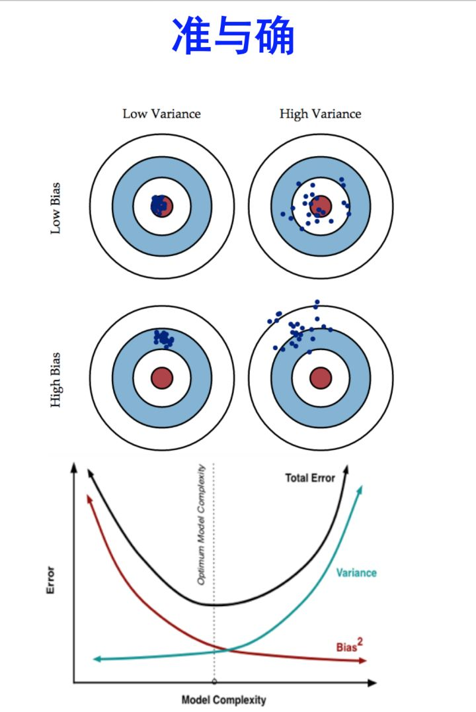

### 计算机知识

----
- [设计模式](notes/设计模式.md)

### 每日小段子
----
- [mean normalization ](#)均值归一化，特征缩放(feature scalling)的一种方法，目的是为了梯度下降(Gradient Descent)的更快，收敛所需迭代次数更少！
- [gradient descent](#) 梯度下降的正确运行
要确保梯度下降算法正确运行，需要保证 J(θ)在每一步迭代中都减小，如果某一步减少的值少于某个很小的值 ϵ , 则其收敛。如果梯度下降算法不能正常运行，考虑使用更小的步长α，这里需要注意两点：
1）对于足够小的α,  J(θ)能保证在每一步都减小；
2）但是如果α太小，梯度下降算法收敛的会很慢，意味着需要大量的迭代次数；
总结：
1）如果α太小，就会收敛很慢；
2）如果α太大，就不能保证每一次迭代J(θ)都减小，也就不能保证J(θ)收敛；
如何选择α-经验的方法：
..., 0.001, 0.003, 0.01, 0.03, 0.1, 0.3, 1...
约3倍于前一个数。

- [bias](#) 偏差
- [variance](#) 方差
- [error](#) 误差
- [error = bias + variance](#) Error反映的是整个模型的准确度，Bias反映的是模型在样本上的输出与真实值之间的误差，即模型本身的精准度，Variance反映的是模型每一次输出结果与模型输出期望之间的误差，即模型的稳定性

- [更多了解，查看知乎](https://www.zhihu.com/question/27068705)

[over-fitting、under-fitting](#) 过拟合、欠拟合;过拟合导致高方差(high variance)，欠拟合导致高偏差(high bias)；使用简单的模型去拟合复杂数据时，会导致模型很难拟合数据的真实分布，这时模型便欠拟合了，或者说有很大的 Bias，Bias 即为模型的期望输出与其真实输出之间的差异；有时为了得到比较精确的模型而过度拟合训练数据，或者模型复杂度过高时，可能连训练数据的噪音也拟合了，导致模型在训练集上效果非常好，但泛化性能却很差，这时模型便过拟合了，或者说有很大的 Variance，这时模型在不同训练集上得到的模型波动比较大

123